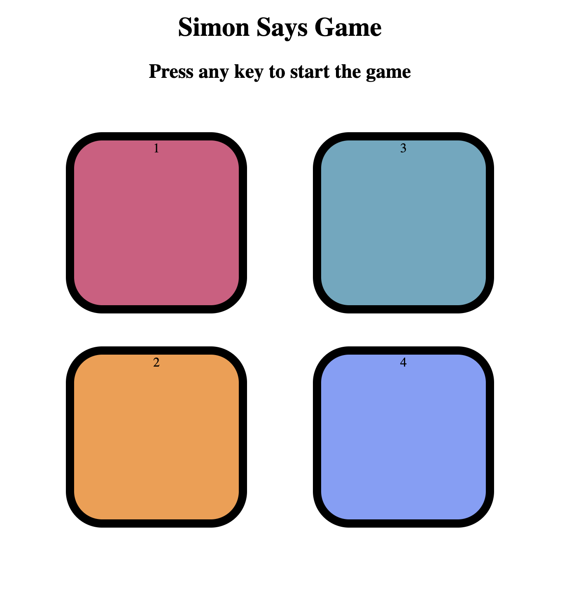

# 🎮 Simon Says Game  

A fun **JavaScript mini project** where you can test your memory and reflexes by playing the classic **Simon Says Game** 🧠✨.  

---

## 🚀 Features  
- 🎨 Colorful interactive UI with 4 buttons.  
- 🔊 Flash effect for both game and user actions.  
- 🏆 Increasing levels as you progress.  
- 💥 Game Over alert with score display.  
- ⌨️ Start the game by pressing any key.  

---

## 📸 Screenshots  

### Game UI  
  

---

## 🛠️ Technologies Used  

- **HTML5** 🌐  
- **CSS3** 🎨  
- **JavaScript (ES6)** ⚡  

---

🎯 How to Play

	1.	Press any key to start the game ⌨️.
	2.	Watch the sequence of button flashes 👀.
	3.	Repeat the exact sequence by clicking the buttons 🖱️.
	4.	With every correct round, the level increases 🚀.
    5.	If you make a mistake → ❌ Game Over.
  
---

💡 Future Enhancements

	•	🔊 Add sound effects for each button.
	•	🖼️ Add animations and smoother transitions.
	•	📱 Make the game fully mobile-responsive.

---

🤝 Contributing

Contributions, issues, and feature requests are welcome!

---

🏅 Author

👩‍💻 Developed by me as part of a JavaScript Mini Project.

---

## 📂 Project Structure  

```bash
├── index.html       # Main game layout  
├── mini2.css        # Styling for the game  
├── mini2.js         # Game logic  
├── screenshot.png   # Game screenshot (add this)  
└── README.md        # Documentation

